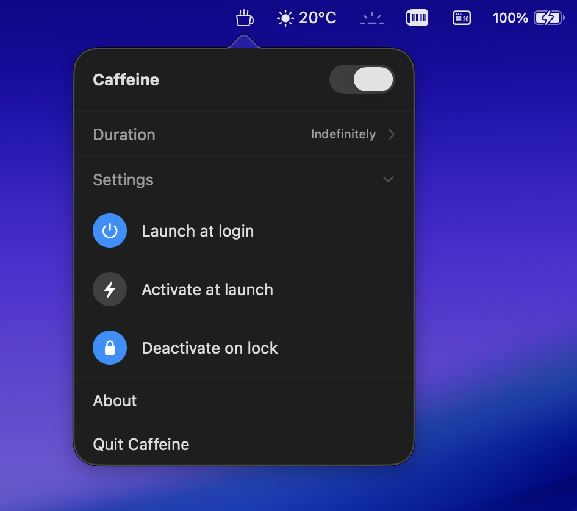

# Caffeine

A macOS menu bar app that prevents your display from sleeping.


## Features

- Lives in the menu bar, no Dock icon
- Toggle sleep prevention on/off with a animated cup icon
- Optional countdown timer: 15 min, 30 min, 1 hr, 2 hrs, 5 hrs, or indefinitely
- Remembers your last-used duration between launches
- Remaining time shown next to the menu bar icon
- Deactivate automatically when your screen locks
- Notification when a timed session expires
- Launch at Login support
- Activate at Launch support
- Siri and Shortcuts integration

## Screenshot



## Requirements

- macOS 13.0+
- Xcode 15+

## Getting Started

1. Clone the repo and open `Caffeine.xcodeproj` in Xcode
2. Set your Development Team under **Signing & Capabilities**
3. Build (Cmd+B), then drag `Caffeine.app` from the build folder to `/Applications`

## How it works

Uses an `IOPMAssertion` (`PreventUserIdleDisplaySleep`) to tell macOS not to sleep the display. The assertion is released when Caffeine is toggled off, when a timer expires, when the screen locks (if that option is enabled), or when the app quits.

You can verify it's active from Terminal:

```sh
pmset -g assertions
```
